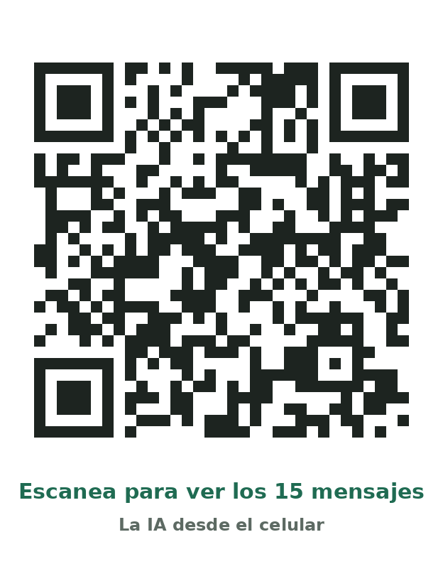

# La IA desde el celular — demostración práctica

Material de apoyo para la demostración **"La IA desde el celular: cómo usar inteligencia artificial para mejorar tareas del trabajo"**.

Esta demostración fue presentada en la **70.ª Plenaria de la Junta Directiva Nacional de UTRADEC-CGT** por la **Comisión de Impacto de la IA en el Trabajo**.

Los asistentes escanean un código QR, abren esta página en su teléfono y copian 15 mensajes laborales simulados. Luego los pegan en su aplicación de IA (Claude, ChatGPT, Gemini u otra), le piden con sus propias palabras lo que necesitan y ven cómo la IA ordena, prioriza y propone respuestas.

**Página de la demostración:** https://vlade0326.github.io/demo-ia-celular/

## Cómo usarla

1. Escanea el código QR o abre el enlace de arriba.
2. Toca **Copiar los 15 mensajes**.
3. Abre tu aplicación de IA, pega los mensajes y dile con tus palabras qué necesitas (por ejemplo: *"Ordena estos mensajes por prioridad y ayúdame a responderlos"*).
4. Revisa la clasificación y las respuestas propuestas antes de usarlas.

## Qué contiene

| Archivo | Descripción |
|---|---|
| `index.html` | Página con el puente entre la IA, las empresas y los trabajadores, los 15 mensajes con botones para copiar y los integrantes de la comisión. Funciona sin instalar nada. |
| `qr.png` | Código QR que abre la página (para insertar en diapositivas). |
| `qr-con-texto.png` | El mismo QR con la leyenda "Escanea para ver los 15 mensajes", listo para proyectar o imprimir. |
| `README.md` | Este documento. |

## El puente entre la IA, las empresas y los trabajadores

- **La IA** es una herramienta: ayuda a organizar, resumir y redactar, pero no decide ni reemplaza el criterio de las personas.
- **Las empresas** adoptan la tecnología y deben informar y consultar antes de introducir IA que cambie la forma de trabajar.
- **Los trabajadores** tienen derecho a formación, a ser escuchados y a que la IA mejore su trabajo sin precarizarlo.

El diálogo social es ese puente. La comisión trabaja para que la tecnología llegue a los puestos de trabajo con información, formación y negociación colectiva.

## Los 15 mensajes simulados

Provienen de clientes, compañeros, supervisores y áreas administrativas: pedidos por confirmar, informes, presupuestos con hora límite, cambios de producto, reuniones, documentos con fecha de vencimiento, una impresora dañada, una capacitación obligatoria y consultas generales. Están pensados para que haya una mezcla clara de asuntos urgentes, importantes y que pueden esperar.

## Buenas prácticas

- Todos los datos son **ficticios**.
- No introduzcas contraseñas ni información confidencial real en una herramienta de IA.
- Verifica siempre lo que propone la IA antes de usarlo.
- La IA ayuda a organizar, resumir, priorizar y redactar; **la decisión final es de la persona**.

## Comisión de Impacto de la IA en el Trabajo — UTRADEC-CGT

- Joaquín Emilio Gómez Manzano
- Tatiana Moreno
- Licep Alexandra Briceño Torres
- Heriberto Rodríguez
- Edgardo Meneghello — **UITIDET**
- Andrés Bohórquez C.
- Vladimir Ceballos Adarve — **Secretario Técnico**

## Publicar la página (GitHub Pages)

En el repositorio: Para desarrollo de actividad.

---

Preparado por Vladimir Ceballos para la Comisión de Impacto de la IA en el Trabajo — UTRADEC-CGT.
